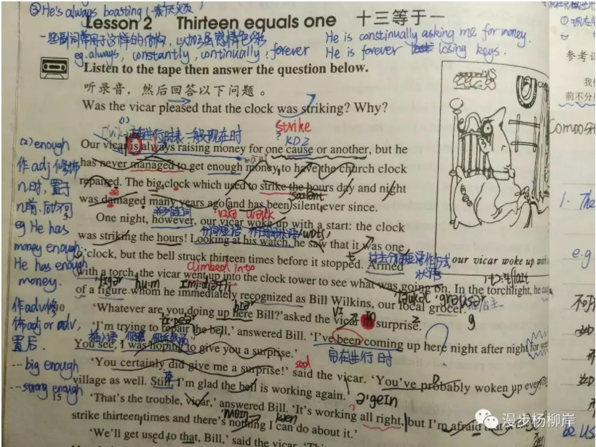
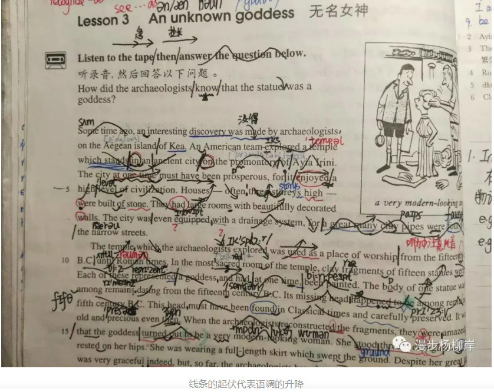
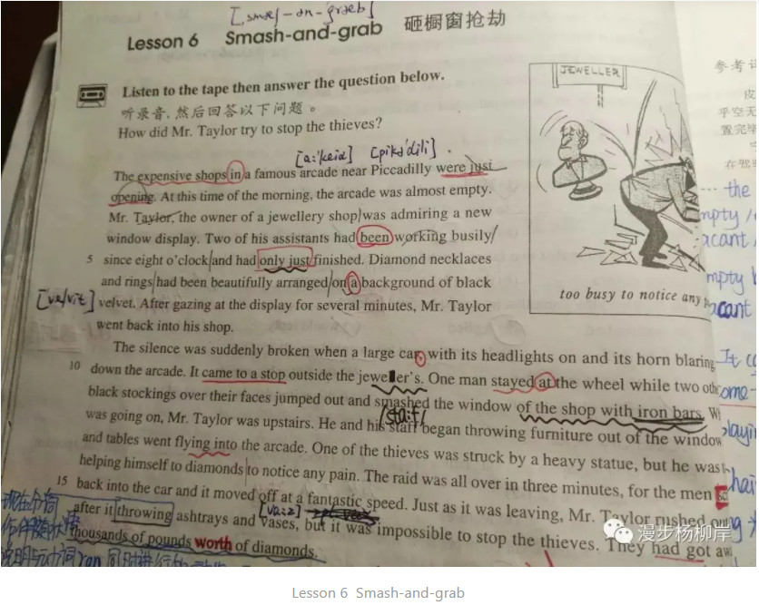
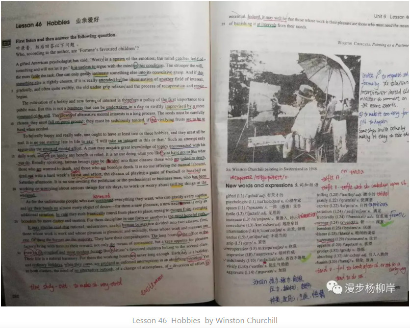

# 2.2 如何背英文文章？

## 2.2.1 技巧

根据我本人多年学英语的经验，先推荐几本好书：《新概念英语》3、4册（写作阅读能力），《走遍美国》（练口语必备），《剑桥中级英语词汇》，《剑桥高级英语词汇》

***背诵英语文章方法：（来自王江涛老师）***

一：**搞清逻辑脉络。**要背的英语文章不是死记硬背，一定要有中文译文，先不要看英文，先看中文，搞清其中的逻辑脉络：一共几段，每段几句，每句和每段之间是什么逻辑关系，再去背诵，就会易如反掌。

二：**背熟中文译文**，这也是背熟文章的关键。很多同学之所以英文文章背不下来，或者背完就忘，其根源在于没有背中文译文。

三：**是多听英文录音**。听的同时，你最好反复跟读模仿，顺便学好了听力口语

四：**进行中英互译**，主要针对英语基础较好的同学。可以先不看中文，自己把英文原文译为中文，再把自己翻译的译文与地道的译文仔细对比，有出入的地方往往就是自己阅读的弱点，仔细对比，用心之后，自然容易背诵。同理，也可先不看英文，根据中文译文，自己译成英文，再把自己翻译的英文与原文仔细对比，也对背诵颇有帮助。

如果你是想**应试**，比如中高考、**46级**，有听力题的依然适用！**听力材料对话背下来，再默写，再听**，绝对快速提高！一个月就见效！

## 2.2.2 英语进阶之路

**三个字：背文章。**大二大三两年，我陆续背完了《走遍美国》、《人生成功12课》、《新概念英语》第三、四册上的80多篇、《生而为赢》上的10篇和十几篇名人演讲。寒暑假集中背，平时巩固。

#### **反人性的七步背诵法**

话说回来，背，这个方法看起来很简单。谁不会呢？谁没有做过“熟读并背诵全文”的语文作业？但能做到我这么反人性的可能不多。

我们来看看有多反人性。

我们来看看有多反人性。

> **第一步：听音频，复述大意。对照原文，找出差距。**
>
> **第二步：逐句听写，听一句写一句。对照原文，标记听不出、听错的地方，分析原因，再反复听。**
>
> **第三步：对文中一切疑难、不能准确把握的地方进行查阅、记录。**
>
> **第四步：反复视译、笔译、模仿性写作。对照原文，找出差距、差异，分析原因。**
>
> **第五步：逐句模仿，力求在语音、语调、语气上达到100%一致。**
>
> **第六步：反复跟读文章、朗读笔记，直至倒背如流。**
>
> **第七步：复习，根据记忆曲线定时重复第六步。**

你可能看出来了，这已经不是单纯的背诵了。这是死磕、死抠、模仿、形成口腔肌肉记忆并把握听说读写的每一个细节。在这之后，背下来只是一个水到渠成的结果。

上述任何一个步骤，要做到、做好都要花费一番功夫。**任何一步，都需要你不怕麻烦、不惧挑战、扛住枯燥、挡住诱惑、保持专注。**任何一步，都可以把万千声称想学好英语而不够坚定的人挡在门外。

以第五步逐句模仿为例。力求在语音、语调、语气上达到100%一致是什么概念？

先来看看我刚开始背诵的几篇文章上留下的模仿痕迹：

线条的起伏代表语调的升降

这有多费功夫？要花多少时间？

我清晰地记得，有一个不长的句子，我用0.5倍语速播放，反复听、模仿、记录、把握细微的差别，再大声地跟读、录音、对比，直到一张口就听到一个标准、漂亮、流畅的句子。

完成这一切，一个小时过去了。

是的，一个小时。为什么这么多年过去了，我对这个时间还如此清晰，就是在那一瞬间我的心里涌起一股强烈的终于守得云开见月明的欣喜、激动和感慨。

这种火力全开把握一切细节、不断校正直至几乎一致的死磕，效果是立竿见影的。我很快就把握住了语音、语调、语气的套路。在后面的学习中，第五步几乎不再耗费什么时间。我就是很愉快地欣赏着音频、欣赏着自己说出的句子。

你看，背到第六篇，课文上起伏的线条基本不见了。

Lesson 6  Smash-and-grab

那么，一篇文章按这七个步骤严格死磕下来我要用多久？

前十几篇250-300词的文章，平均每篇花10小时。慢慢地，速度越来越快，后来把握一篇《新概念英语》第四册上约600词的文章，如Lesson 46，只需5-6小时。

Lesson 46  Hobbies   by Winston Churchill

核聚老师说，

> 练习任何技能进入化境都需要穿越重重痛苦的境地。

我的英语水平虽未达化境，却也强于过去千百倍。要说这个质变的过程不痛苦、我从没想过放弃，那是骗人的。

当时正值青春年少，寒暑假不少同学或是在家享受港湾的温暖或是满世界疯玩。我每天睁开眼睛就打开Walkman听音频，戴上耳机对着空气一通跟读，练到口腔肌肉酸痛，练到深夜梦话脱口而出“Confidence!”。

遗忘的痛苦、独行的孤单、花花世界的诱惑就像四散在路上伏击的野兽，冷不丁就跳出来咬我一下。

**为什么我做到了？为什么，我以那样麻烦、反人性的方式，背下了不是十几篇，也不是二十几篇，而是100多篇文章？**

在一点一点的回忆中，我逐渐看清了背后的秘密。

####  **秘密一：必须成功的决心**  

在单纯懵懂的大学时期，我不知道、不懂得把握的东西很多。但有一样是我无比清晰无比坚定的，那就是必须彻底掌握英语，必须拥有在英语世界畅行无阻的能力。

这份坚定来自一段有情故事。

那一年，我从县城考上了市属重点高中的重点班。那一年，第一次近距离接触了富二代、官二代和自带光环的学霸们，一无所长的我成为班上的小透明。那一年，数理化跟不上，连续考出几个倒数，身心备受打击，一再沉沦。

在我都快不相信自己的时候，我的英语老师在全班面前鼓励我，如果改学文科，好好把握剩下的时间，我一定可以考上重点大学。

如果你也曾那么失意，你就知道那种鼓励是多么珍贵，以至于你无法辜负它。他的话像一把火燃起了我全力拼搏、考上重点大学、把握自己的命运的决心。

最后我做到了，也获得了英语成绩从及格线起步连续四月每月提高10分的战绩。关于这个逆袭的故事，此处省略1万字。

所以对我来说，英语承载着我对老师的感激、在低谷中拼搏的泪水和最终达成目标的骄傲。我可以在别的事情上失败，但我绝不允许自己在这件事情上失败。

####  **秘密二：付出与目标匹配的努力** 

查理·芒格说，

> 要得到你想要的某样东西，最可靠的办法是让你自己配得上它。

显然一开始，我是没有这种意识和心理准备的。我严重低估了掌握一项技能所需要的刻意练习，幻想着能轻轻松松“潜移默化”，然后某一天奇迹自然发生。

我被现实狠狠打过两次脸。

第一次，我学着别人的样子，早上捧着收音机听VOA，早起去花园读书，积极跟外教聊天，参加英语角……而事实是，VOA没听懂的就过了，晨读读不同的内容，跟外教聊天我问人家答、我听人家说，英语角总共也没去多少次。

一个学期很快过去了，牛人还是牛人，我还是我。

第二次，那是一个把自己都感动到不行、千里求学的鸡汤故事呢！

当时的新东方是英语培训界的杠把子。在听了新东方三大元老俞敏洪、王强、包凡一来我们学校的演讲后，我对北京新东方产生了迷一样的崇拜。于是我挪了一个学期的生活费报了它为期两周的听说速成班。

那一年，18岁的我只身一人坐了25小时绿皮火车，于凌晨1点到达北京西站。在一个睡了7、8个人的青旅小房间里，我抱着行李和衣而卧，不敢睡觉。撑到早上6点，打的赶到五环外的校区上课。付给司机155块，而我当时一个月吃饭还只花不到250块。

上课的老师很厉害，不仅会讲课还很会讲段子，几百人的教室里经常满堂乐。十几天后，快结课了。在一片欢笑声中，我心里惊雷一样闪过几个问题，我的听说能力速成了吗？我比十几天前讲得更流畅了吗？听得更明白了吗？

答案是没有。那我不顾一切的朝圣之旅收获了什么？十几天的段子？？？！！！

上完课就能功力大涨的幻想彻底破灭了，轻轻松松掌握英语的妄想也粉碎了。浪费的时间和钱让我不得不痛定思痛。

一番反思后，我不再妄想，很快也就看清了问题所在，继而也看到了唯一的出路：付出与目标匹配的努力。

####   **秘密三：设定当天目标，以一日论成败**  

在参考了林语堂、辜鸿铭等大师的背诵法和不少牛人分享的背诵经历后，洗心革面的我制定了自己的背诵七步骤。当时流行背《新概念英语》，于是我选了第三册来背。

那本书有271页共60篇课文。用反人性的七步背诵法背完60篇课文，单是这个想法就会让人压力山大，士气衰竭。我很熟悉这种压力，它经常是阻止我开始的障碍或在低谷中压垮我的最后一根稻草。

但我已经没有退路，我要么付出相匹配的努力彻底掌握这项技能，要么永远无法掌握它。这一次，我必须扛住这种压力，坚持到底。

当时我还不认识核聚老师，也没听过什么目标法则。在按艾宾浩斯记忆曲线做每日复习计划时，我忽获灵感：每一天，我只有一个任务，就是背下一篇新文章和复习某几篇文章。达成了，就是成功的一天。

这是一个有标准、可衡量、经过努力可以达成的目标，长则十几小时，效率高、进步后则还可以不断缩短时间。那么每一天，我没有失败的理由。

正是无意间践行的这个秘密让我从那种压力中解脱出来，能最大限度地集中精力和注意力。而且每当感到枯燥、烦闷，开始走神时，看一下当天的进度条就可以让我很快收回心神，继续死磕。

每天夜晚，当我操着一口漂亮、流利的英语背诵着我的目标文章，我就像重新充满电的战士，又可以奔赴下一个战场。

####  **秘密四；：多维度的及时反馈** 

反馈是行动是否有效的试金石，是自信心、效能感和愉悦感的来源。

没有反馈，就不清楚自己是进是退，容易陷入迷茫、失去斗志。而如果有及时反馈，则可以产生反思、改进，促使人勇猛精进甚至一日千里。

我能重复七步背诵法上百次的另一个秘密就在于这两个字：反馈。

七步背诵法的每一步都有一个标准：达到一致。复述与原文大意一致，语音语调与音频一致、听写翻译背诵与原文一致。

其实每一次对照就是一次反馈，继而产生校准、反思、改进。再对照，再获得反馈，再次校准、反思、改进，直至准确把握，达到一致。看似反人性的方法中隐藏着让人勇猛精进的玄机。

背完几十篇文章后，我知道自己的英语能力已不同往日，但究竟在什么水平呢？于是我要求自己尽可能多地举手发言、做课堂主题分享、参加演讲比赛、跟外教讨论话题、指导其他系的学生学英语。

我又得到了许多反馈，比如老师的赞许、同学的惊讶、流畅表达的愉悦、比赛获奖的荣誉、外系学生“不亏是英语专业”的感叹。我又获得了极大的信心、快乐和精进的动力，然后一发不可收拾地背了更多文章。

以上就是我如何背完100+英语文章的故事和秘密。

过去我只知自己的故事，不知这背后的秘密，所以我突破了英语，却在别的技能突破上依然感到困难。

这一次，我用了5个白天和夜晚去回忆、记录、整理、思考，终于看清楚我是如何一步一步从蹩脚来到愉快、从容的畅行境界。这一次，我已经领悟到做好一件事情、掌握一项技能的秘密。

掌握秘密，实践一次，终生不忘，人生开挂。

学习本就如此，期待你早日亲证！

## 2.2.3 总结
1. 背完二阶的语料库（生活实用+走遍美国+新概念1）
2. 口语听力方面：听音频，逐句听写，查疑难，反复跟读，模仿，朗读，复习
3. 论文方面。英译中，查疑难，句，段逻辑。默写